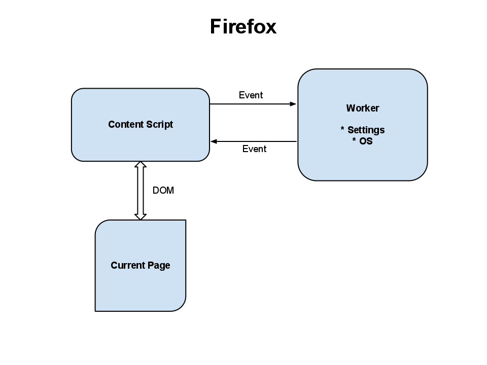
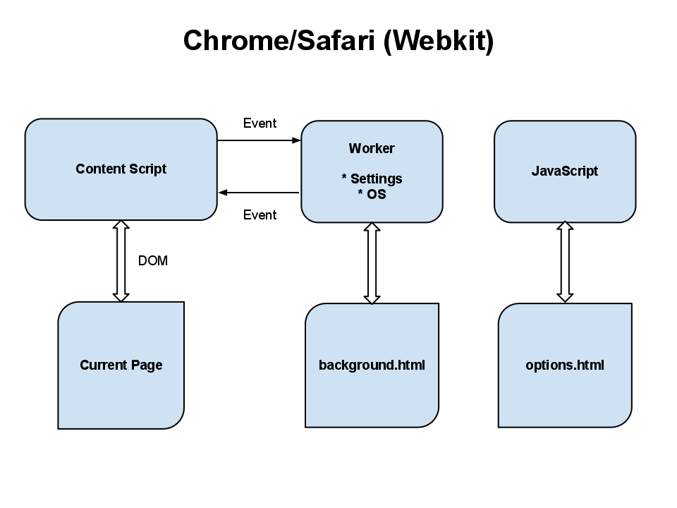

!SLIDE 

# Careplane
## A browser plugin

!SLIDE

# Demo
## For the Camp

!SLIDE

# Writing a Browser Plugin

!SLIDE

# 3 Different browsers
## But basically the same idea

!SLIDE center

!SLIDE center

!SLIDE

# Problem: Inconsistent APIs

* Saving/Loading Settings
  * Configuration Panels
* Loading local assets (CSS, etc)

!SLIDE

# Solution: Modular, Tested JS

* Prototypes/Classes
* CommonJS Modules
* Jasmine/vows.js

!SLIDE center

[http://github.com/substack/node-browserify](http://github.com/substack/node-browserify)

!SLIDE

# Problem: Packaging

* File layout
* Package format (zip, signed)
* Configuration/UI files

!SLIDE

# Solution: Automation

* Ruby
* `rake release`

!SLIDE code small
    @@@ ruby
    # Rakefile - http://is.gd/IUHuGf

    desc 'Build Google Chrome extension'
    task :build_chrome => 'google_chrome:templates' do
      puts 'Building Chrome, Copying assets...'
      (@css_files + @image_files).each do |file|
        destination = File.join('google_chrome', file)
        FileUtils.mkdir_p File.dirname(destination)
        puts "#{file} > #{destination}"
        FileUtils.cp file, destination
      end

      browserify 'lib/google-chrome.js',
                 'google_chrome/application.js'

      browserify 'lib/google-chrome-background.js',
                 'google_chrome/background.js'
    end

!SLIDE

# Problem: Distribution

* App stores :p
  * Chrome store is super easy, though

!SLIDE

# Solution: None

* Fight with reviewers
* Self-hosted

!SLIDE small

# Thanks!

* @dkastner on Twitter
* Install it: [careplane.org](http://careplane.org)
* Full source: [github.com/brighterplanet/careplane](http://github.com/brighterplanet/careplane)
* self.url: [github.com/dkastner/careplane_pres](http://github.com/dkastner/careplane_pres)
* All the things: [github.com/dkastner](http://github.com/dkastner)
