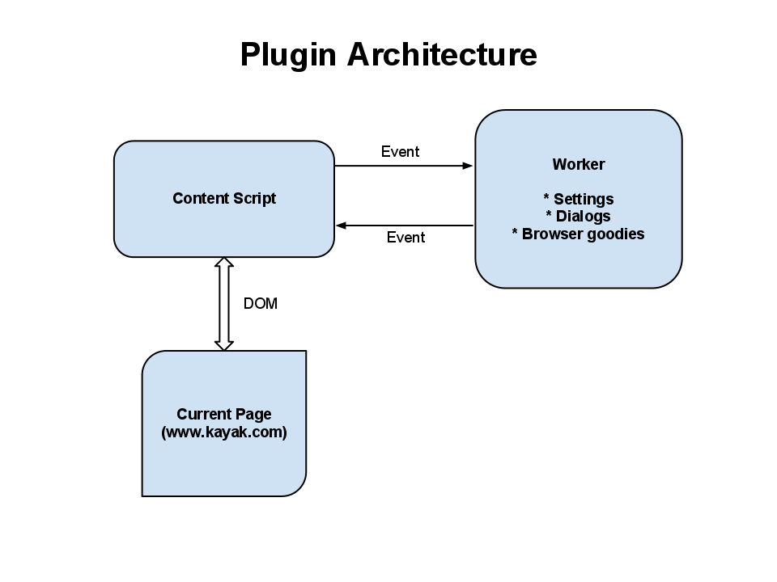

!SLIDE 

# Careplane
## A browser plugin

!SLIDE

# Demo
## For the Camp

!SLIDE

# 3 Different browsers
## But basically the same idea

!SLIDE center

!SLIDE

# Problem 1: Site Updates

!SLIDE code smaller

# Solution: Tests

    @@@javascript
    describe('KayakFlight', function() {
      var KayakFlight = require('drivers/kayak/kayak-flight');

      describe('.parse', function() {
        var flights;
        beforeEach(function() {
          loadFixtures('kayak_dtw_sfo_flight.html');
          flights = KayakFlight.parse(
            $('.inlineflightitinerarylegs tr'));
        });

        it('returns an array of flights', function() {
          expect(flights.length).toBe(4);
          expect(flights[0].airline).toMatch(/Continental/);
          expect(flights[0].origin).toBe('DTW');
          expect(flights[0].destination).toBe('ORD');
          expect(flights[0].aircraft).toBe('Canadair Regional Jet');

!SLIDE code smaller

# Solution: More Tests

    @@@ cucumber
    Feature: Kayak
      As a Careplane user
      I want to see footprints on Kayak.com

      Background:
        Given I am visiting "www.kayak.com"

      Scenario: Basic Kayak search
        When I go to the home page
        And I search for a flight from "DTW" to "SFO"
        And Careplane runs when the page finishes loading
        Then I should see the Brighter Planet badge
        And I should see carbon footprints

!SLIDE

# Problem 2: Browser APIs

* Loading/Saving settings
* Configuration Panels
* Injecting custom CSS, etc

!SLIDE code smaller

# Solution: Modular Code

    @@@ javascript
    var Preferences = require('../../preferences');

    var ChromePreferences = function() { };
    ChromePreferences.prototype = new Preferences();

    // var pref = new ChromePreferences();
    // pref.get('favorite.color', function(color) {
    //   alert('my favorite color is ' + color);
    // });
    // pref.get => Preferences.get => ChromePreferences.nativeGet
    ChromePreferences.prototype.nativeGet = function(key, cbId) {
      chrome.extension.sendRequest({
        action: 'preferences.get',
        key: key,
        callbackId: cbId
      });
    };

    module.exports = ChromePreferences;

!SLIDE center

[github.com/substack/node-browserify](http://github.com/substack/node-browserify)

!SLIDE

# Problem 3: Packaging

* File layout
* Package format (zip, signed)
* No IDE support

!SLIDE code small

# Solution: Automation

    @@@ ruby
    desc 'Build Google Chrome extension'
    task :build_chrome => 'google_chrome:templates' do
      puts 'Building Chrome, Copying assets...'
      (@css_files + @image_files).each do |file|
        destination = File.join('google_chrome', file)
        FileUtils.mkdir_p File.dirname(destination)
        puts "#{file} > #{destination}"
        FileUtils.cp file, destination
      end

      browserify 'lib/google-chrome.js',
                 'google_chrome/application.js'

      browserify 'lib/google-chrome-background.js',
                 'google_chrome/background.js'
    end

!SLIDE

# Problem 4: Distribution

* App stores :p
  * Chrome store is super easy, though

!SLIDE

# Solution: None

* Fight with reviewers
* Self-hosted

!SLIDE small

# Thanks!

* @dkastner on Twitter
* Install it: [careplane.org](http://careplane.org)
* Full source: [github.com/brighterplanet/careplane](http://github.com/brighterplanet/careplane)
* self.url: [github.com/dkastner/careplane_pres](http://github.com/dkastner/careplane_pres)
* All the things: [github.com/dkastner](http://github.com/dkastner)
